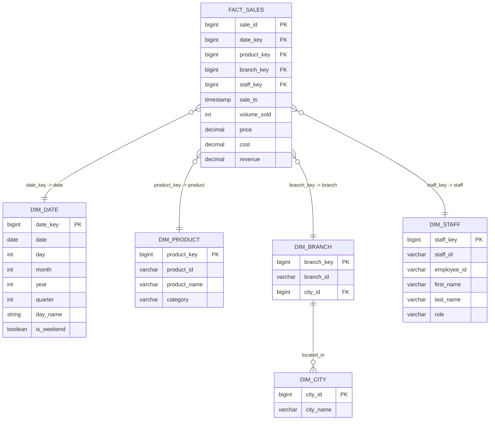

# DieBäckerei™ ERD (Mermaid)

Below is the Mermaid `erDiagram` block for your DieBäckerei™ schema.  
You can paste this into **Mermaid Live Editor** or any Markdown renderer that supports Mermaid to render the ERD.

## Mermaid ERD (paste into a mermaid-capable viewer)

## How to render
- Use the **Mermaid Live Editor** (https://mermaid.live/) — paste the block and it will render instantly.
- If you use GitHub Pages, MkDocs, or a modern Markdown editor (VS Code with Mermaid extension), the ERD will render inside your README.md automatically.
- To include in your repository, add this file (or paste the block) to a `README.md` or `docs/` page.

## Want an SVG?
I can export an SVG for you using the Mermaid Live Editor and attach it here — if you'd like that, tell me **"Export SVG"** and I'll generate and provide the file now.
